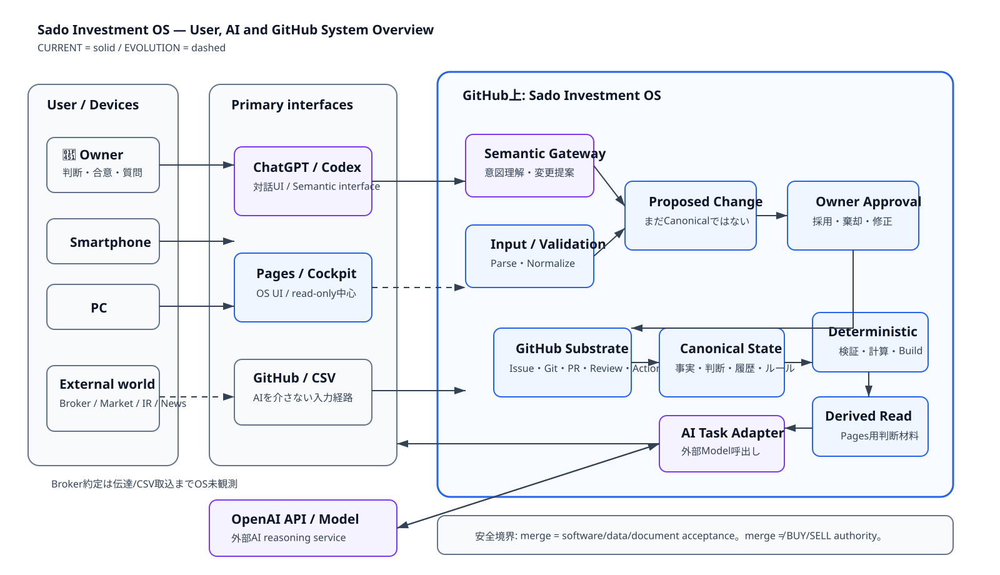
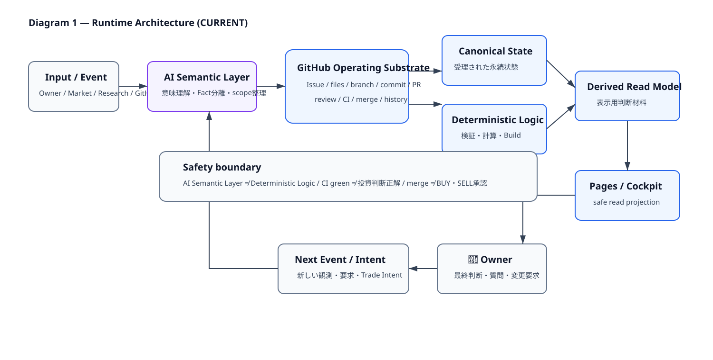
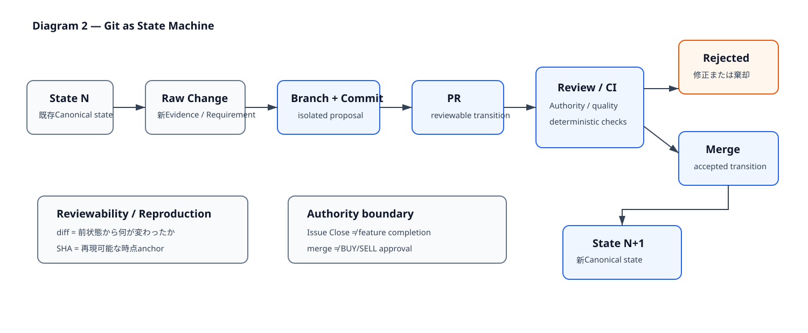
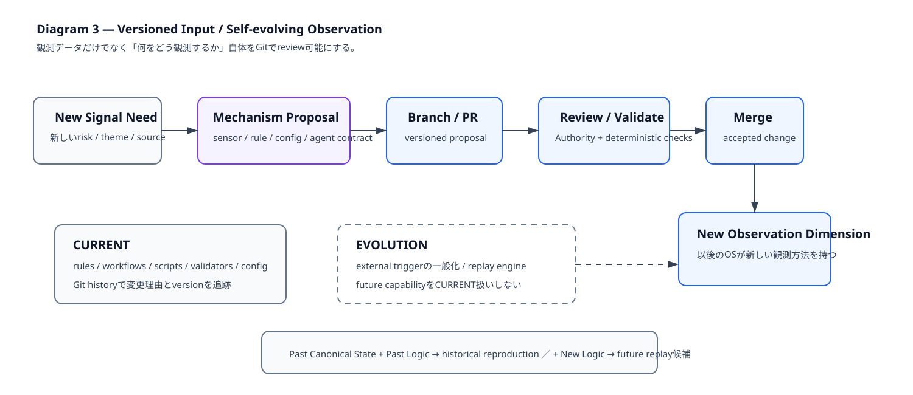

# Git-Native Agentic Runtime — Diagrams

> Issue #349 / PR2  
> 担当: 🌊ナギ  
> 種別: Architecture / Diagram / Accessibility  
> Source of truth for concepts: `GIT_NATIVE_AGENTIC_RUNTIME.md`  
> Visual design input: 🌙ルナ comment `5254030161` + FigJam `hBNZD9EaQzRoUqhR5YBMKc`

この文書は4枚のSVGを**補助図**としてまとめる。図だけをAuthorityにせず、意味・安全境界・CURRENT / EVOLUTIONの区別は本文でも読めるようにする。

## Legend

- **Blue**: Sado Investment OS / GitHub側の責務
- **Purple**: AI / semantic reasoning側の責務
- **Neutral gray**: User / devices / external world / safety note
- **Solid line**: CURRENTとして確認済みの主経路
- **Dashed line**: EVOLUTION、外部観測境界、または将来input経路

重要な安全境界:

- `AI Semantic Layer ≠ Deterministic Logic`
- `CI green ≠ 投資判断が正しい`
- `merge ≠ BUY / SELL approval`
- Brokerで約定しただけではOSは自動的に認識しない。伝達・CSV取込・将来integration等を経て初めてOS inputになる。
- Pages inputを直接Canonical truthへ昇格させない。Validation / Proposed Change / Owner Approvalを経由する。

---

## Diagram 0 — User / AI / GitHub System Overview

### Accessible explanation

👑OwnerはSmartphone / PCから主に2つのinterfaceを使う。

1. **対話UI: ChatGPT / Codex** — 意図や文章を理解し、変更候補を作るSemantic Interface。
2. **OS UI: Pages / Cockpit** — 現在はread-only中心の判断用projection。将来validated inputを持つ場合も、直接Canonical stateを書き換えない。

GitHub上のSado Investment OSは、Input / Validation、Proposed Change、Owner Approval、GitHub Operating Substrate、Canonical State、Deterministic Logic、Derived Read Modelを持つ。ChatGPT / CodexとOpenAI API / Modelは同一ではない。OpenAI APIはOS内のAI Task Adapterから呼び出される外部reasoning serviceで、responseはReview / Approval / Persistenceを経て初めて永続状態候補になる。

市場・IR・Newsや証券会社の約定はGitHub外の現実世界に存在する。取得・伝達されていない出来事をOSが「知っている」と扱わない。

---

## Diagram 1 — Runtime Architecture

### Accessible explanation

CURRENTの代表flowは、Input / Event → AI Semantic Layer → GitHub Operating Substrate → Canonical State / Deterministic Logic → Derived Read Model → Pages / Cockpit → 👑Owner → Next Event。

この矢印は「全イベントが必ず一本道を通る」という意味ではない。AI Semantic Layerは意味理解・Fact分離・scope整理、Deterministic Logicはvalidation・calculation・buildを担い、**視覚的にも別layer**として扱う。GitHubは中央のOperating Substrateだが、mergeはsoftware/data/document transitionの受理であって投資判断Authorityではない。

---

## Diagram 2 — Git as State Machine

### Accessible explanation

State Nに新Evidence / Requirementが発生したら、Raw Change → Branch + Commit → PR → Review / CIへ進む。Acceptされた変更だけがmergeされState N+1になる。Rejectされたproposalは修正または棄却される。

`diff`は前状態との差、`SHA`は再現可能な時点anchor。Issueはunresolved work、PRはproposed transitionなので、Issue Closeだけで機能完成を判定しない。またmerge済みであってもBUY / SELL承認を意味しない。

---

## Diagram 3 — Versioned Input / Self-evolving Observation

### Accessible explanation

新しいsignalやriskを観測したくなった場合、データを足すだけでなく、sensor / rule / config / agent contract自体を変更候補としてGit管理できる。Mechanism Proposal → Branch / PR → Review / Validate → Mergeを経ることで、以後のOSは新しい観測dimensionを持つ。

CURRENTでversion controlledなのはrules、workflow、scripts、validators、config等。external trigger一般化やReplay EngineはEVOLUTIONであり、現在実装済みとして描かない。将来はPast Canonical State + Past Logicでhistorical reproduction、Past State + New Logicでreplay / counterfactual比較を行える余地があるが、本PRではengineを実装しない。

---

## PR3 handoff

Pages化するときは4枚を巨大な一枚として縮小表示しない。

推奨順:

`30秒要約 → Diagram 0 System Overview → Diagram 1 Runtime → Diagram 2 Git State Machine → Diagram 3 Versioned Input`

mobileではprogressive disclosureを使い、各SVGの直下に短いcaption / accessible explanationを残す。#320 canonical Design Systemを再利用し、#314 Navigation Authorityを変更しない。