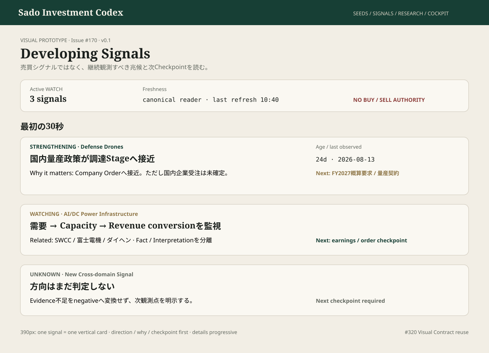

# #170 Developing Signals — Owner Watch Prototype

担当: ⭐️ミナ  
種別: Product UI Design / Visual Prototype  
Status: IMPLEMENTATION_HANDOFF_READY  
Version: v0.1  
Related: #170 / #320 / #356 / #154 / #112

## Prototype

Canonical artifact: `docs/design/prototypes/issue-170-developing-signals.svg`

## 目的
Developing Signalを「ニュース一覧」や「売買シグナル一覧」にせず、**継続観測すべき兆候が今どちらへ動き、次に何を確認するか**を30秒以内に理解するOwner-facing WATCH surfaceとして固定する。

## 30秒の視線順
1. Active WATCH件数 / freshness
2. Direction — STRENGTHENING / WEAKENING / WATCHING / UNKNOWN
3. 何の兆候か
4. Why it matters
5. Related entity / theme
6. age / last observed
7. Next checkpoint
8. source / Researchへdrill-down

## Mobile Contract — 390px
- 1 Signal = 1 vertical card
- horizontal tableを縮小しない
- first viewportでは `Direction / Signal / Why it matters / Next checkpoint` を優先
- source refsや履歴詳細はprogressive disclosure

## Visual Contract
- #320 tokens / primitives / semantic statesを再利用
- directionは色だけで意味を伝えない
- STRENGTHENING = BUY、WEAKENING = SELL に変換しない
- UNKNOWNをnegativeへ丸めない
- Fact / Interpretation / Hypothesisを混在させない
- canonical persisted Signal collection以外をUI truthにしない

## Responsibility Boundary
- #356 Seed: capture / dedup / triage
- #170 Developing Signal: 継続観測 / direction / checkpoint / expiry
- Research Candidate: Transmission path + equity relevance + counter-evidence
- Cockpit: 最終Decision Context

## Design Gate
### BLOCKER
- STRENGTHENING/WEAKENINGを売買推奨へ変換
- UNKNOWNを0/negative扱い
- canonical persistence以外のfixture/manual truthを表示Authorityにする
- mobile横スクロール前提の巨大table
- source freshness / last observed / checkpointが欠落

### SHOULD_FIX
- raw metadataがSignal summaryより先
- FactとInterpretationのラベルが弱い
- overdue checkpointが埋もれる

### NICE_TO_HAVE
- overdue marker
- sensor / theme filter
- first_observed → currentのcompact timeline

## Implementation Handoff
PR4a canonical persistence/read-sourceがmainへ入ったため、Pages/read-model実装は既存readerのみをconsumerとして開始可能。UI側でSignalを手入力補完しない。

Design Gate: **PASS_WITH_NOTES**

Broadcast checked through: comment_id=5275700591 — VERIFIED  
TEAM_STATE User Mode: ACTIVE  
Issue #79 untouched.
