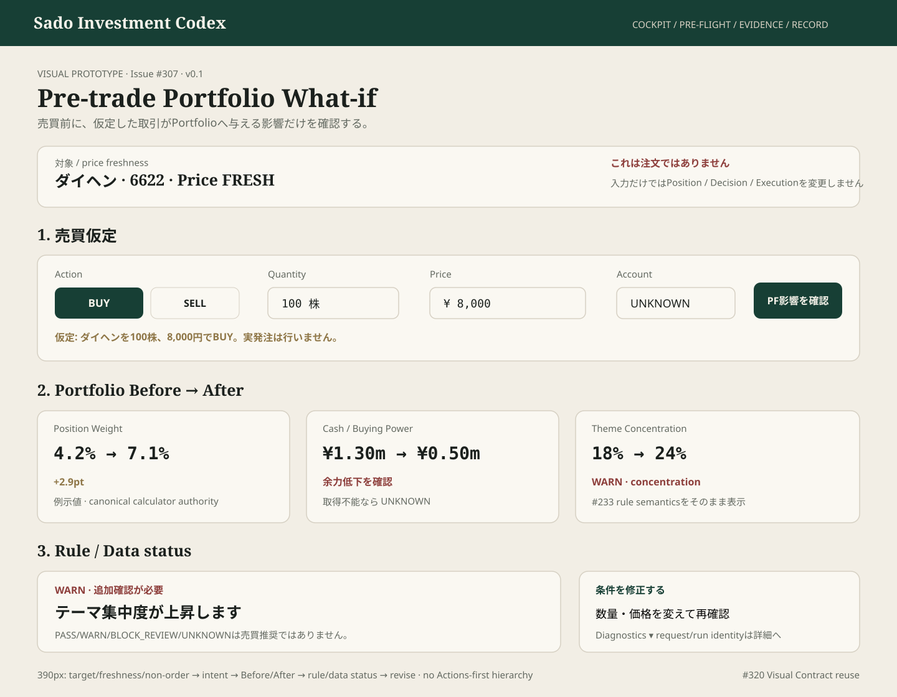

# #307 Pre-trade What-if — Inline Owner Prototype

担当: ⭐️ミナ  
種別: Product UI Design / Visual Prototype  
Status: IMPLEMENTATION_HANDOFF_READY  
Version: v0.1  
Related: #307 / #233 / #320 / #346 / #456

## Prototype

Canonical artifact: `docs/design/prototypes/issue-307-inline-whatif.svg`

## 目的

現行の安全な `Request ID → GitHub Actions → Pagesへ戻る → exact run` bridgeを否定せず、Owner-facing体験の最終形を **「売買条件を入れる → 仮定を確認する → Before/Afterを見る → 警告/不足を理解する → 条件を修正する」** へ収束するためのVisual baseline。

GitHub Actions / request_id / run_id / telemetryは必要な実装境界だが、通常利用時の情報階層では主役にしない。

## 30秒の視線順

1. 対象銘柄 / price freshness / 「これは注文ではありません」
2. 売買仮定 — BUY/SELL / 数量 / 価格 / account context
3. 仮定内容の確認
4. Portfolio Before → After
5. Rule result — PASS / WARN / BLOCK_REVIEW / UNKNOWN
6. データ不足 / stale / not-judgableの人間向け説明
7. 条件を修正する
8. diagnostics / request-run identityは詳細層

## Mobile Contract — 390px

- 1-column。
- first viewportで `対象 / freshness / 非発注境界 / BUY-SELL / quantity / price` を理解できる。
- CTAは `PF影響を確認` をprimary、結果表示後は `条件を修正` を明確に戻り導線として置く。
- Before/Afterは横長tableを縮小せず、1 metric = 1 comparison row/card。
- warning / unknownは色だけで意味を伝えない。

## State Contract

Owner-facing:

`NOT_STARTED → INPUT_VALID → CALCULATING → CALCULATED`

fail-closed:

`INVALID_INPUT | SOURCE_STALE | SOURCE_UNAVAILABLE | RULE_UNSET | NOT_JUDGABLE | FAILED | EXPIRED`

内部codeだけを出さず、「何が不足し、次に何をすればよいか」を日本語で表示する。

## Visual Contract

- #320 tokens / primitives / semantic statesを再利用。
- Cockpit = Decide context、Pre-trade What-if = Act前確認、Decision Snapshot/Journal = Record。責務を混ぜない。
- BUY / SELLは**入力値**であり推奨badgeではない。
- PASSを「買ってよい」、BLOCK_REVIEWを「売買禁止」のようなInvestment Authorityへ変換しない。
- UNKNOWN / STALE / PARTIAL / RULE_UNSETを正常値へ丸めない。
- stale priceから正常なBefore/Afterを生成しない。
- account_type UNKNOWNをCASHへ推測しない。
- request_id / run_id / calculation telemetryはdiagnostics/detailsへ置く。

## Before / After hierarchy

優先表示:
- 対象銘柄PF比率
- cash / available buying power（canonicalに取得可能なもののみ）
- theme / sector concentration
- existing risk-rule result

取得不能fieldは`UNKNOWN`。UIで仮値を生成しない。

## Design Gate

### BLOCKER
- What-if入力がCanonical Portfolio / Decision / Execution Intent / orderをmutationする
- stale/unavailable priceを正常値として計算
- BUY/SELL入力を推奨表示と誤認させる
- PASS/WARN/BLOCK_REVIEW/UNKNOWNを独自意味へ変換
- mobileで入力→結果→修正が往復できない
- request/run/Actions操作がOwner first-viewの主役
- #233以外の別計算ロジックをUI側に作る

### SHOULD_FIX
- Before/Afterよりdiagnosticsが上位
- `これは注文ではありません` がfirst-viewにない
- quantity / price validation errorが内部codeのみ
- resultから入力へ戻る導線が弱い

### NICE_TO_HAVE
- Before/After deltaのcompact arrow/number treatment
- unavailable metricの理由をinline disclosure
- diagnostics accordionにrequest/run identityを集約

## Implementation Handoff

- 現行#456 bridgeのsecurity/auth境界は維持する。
- inline invoke / retrievalが技術的に成立するまでは、Actions往復をfallbackとして残してよい。
- implementationはsemantic hierarchyをAuthorityとし、prototypeの数値は例示値として扱う。
- token / secretをPagesへ置かない。
- `入力 → 仮定確認 → 計算状態 → Before/After → 警告・不足 → 条件修正` をprogressive flowとして成立させる。

Design Gate: **PASS_WITH_NOTES — implementation may proceed without changing canonical calculation or auth boundaries.**

Broadcast checked through: comment_id=5275700591 — VERIFIED  
TEAM_STATE User Mode: ACTIVE  
Issue #79 untouched.
