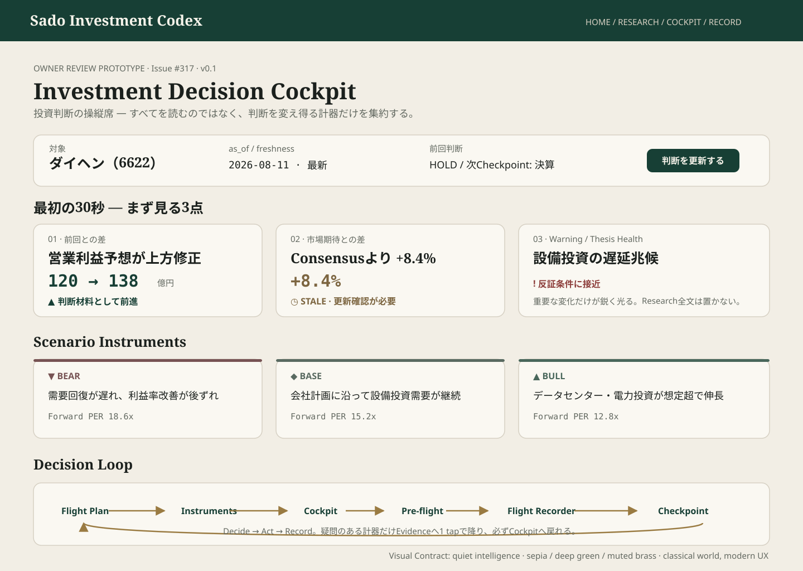

# #317 Investment Decision Cockpit — Owner Review Prototype

担当: ⭐️ミナ  
種別: Product UI Design / Visual Prototype  
Status: OWNER_REVIEW_READY  
Version: v0.1  
Related: #317 / #320 / #313 / #312 / #314

## Prototype

Canonical artifact: `docs/design/prototypes/issue-317-cockpit-owner-review.svg`

## 目的

Investment Decision Cockpitを「金融情報を大量表示するdashboard」ではなく、**Ownerが前回判断を復元し、変化・市場期待差・Warningを短時間で読み、必要な根拠だけ確認して判断へ進む操縦席**として成立させるためのVisual baseline。

## 30秒の視線順

1. 対象 / as_of / freshness / 前回判断
2. 前回との差
3. 市場期待との差
4. Warning / Thesis Health
5. Bear / Base / Bull
6. 必要なEvidenceだけdrill-down
7. Owner判断 → Pre-flight → Decision Snapshot / Flight Recorder

## Visual Contract

- 知的で静か。重要な変化だけが鋭く光る。
- 生成り / セピアをcanvas、深緑をprimary action / orientation、真鍮を補助accentとして使う。
- 世界観は古典・航海/航空計器の温度感を持つが、操作UXは現代的にする。
- Typography D: major headingはSerif、日本語本文/UIはSans、数値はtabular/mono互換。
- status / stale / unavailable / scenarioは色だけで意味を伝えない。
- Research全文、Evidence全文、長大なIR資料、詳細計算過程はCockpitへ常設しない。

## Responsibility Boundary

- Home: 市場 → 自分への影響 → 今日のaction
- Codex Map: 投資OS全体像
- Cockpit: 意思決定室
- Research / Evidence: 根拠確認
- Pre-flight: 売買前Portfolio What-if
- Flight Recorder: immutable Decision Snapshot

## 🌙ルナ Product / IA Reviewで見てほしい点

1. **30秒優先順位**: 上記の視線順が意思決定の順序として妥当か。
2. **Decide → Act → Record境界**: Cockpit / Pre-flight / Decision Snapshotの責務が混ざっていないか。
3. **Metaphor boundary**: Flight Plan / Instruments / Warning / Flight Recorderは理解補助になっており、UI操作名を不自然な航空用語へ置換していないか。
4. **Research boundary**: Cockpitへ載せすぎず、Evidence drill-downで十分な設計になっているか。
5. **Owner authority**: BUY/SELLをUIが自動決定する印象になっていないか。

## 期待する返却物

- Product / IA result: `PASS / PASS_WITH_NOTES / FAIL`
- BLOCKER / SHOULD_FIX / NICE_TO_HAVE
- Visual方向そのものではなく、情報優先順位・意味・責務・導線に関する指摘

## 実装Handoff条件

- #320 Visual Design System primitivesを再利用する。
- prototype画像のpixel-perfect再現を要求しない。情報階層とsemantic visual roleを優先する。
- Canonical data / scoring / BUY-SELL logic / route truthは変更しない。
- mobileでは主要3点が最初の理解範囲に入り、巨大dashboardを縮小表示しない。

Broadcast checked through: comment_id=5246936719 — VERIFIED
