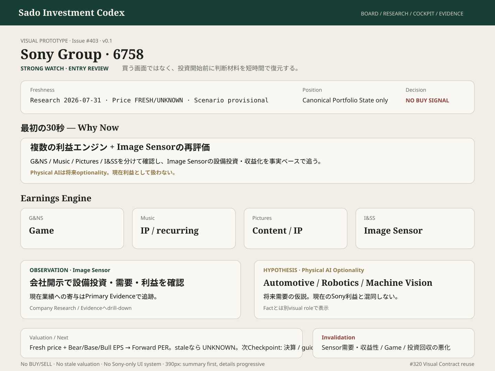

# #403 Sony Entry Review — Owner Review Prototype

担当: ⭐️ミナ  
種別: Product UI Design / Visual Prototype  
Status: IMPLEMENTATION_HANDOFF_READY  
Version: v0.1  
Related: #403 / #320 / #402 / #308 / #312 / #314

## Prototype

Canonical artifact: `docs/design/prototypes/issue-403-sony-entry-review.svg`

## 目的

Sony (6758) をCompany-specific別UIへ分岐させず、既存Investment Review / Company Research / Cockpit contractの中で、**Why Now / Earnings Engine / Image Sensor Fact / Physical AI Hypothesis / Valuation freshness / Next Checkpoint** を30秒以内に理解できるbaselineを固定する。

## 30秒の視線順

1. Sony / 6758 / `STRONG WATCH · ENTRY REVIEW`
2. price / research / scenario freshness
3. Why Now
4. Earnings Engine — G&NS / Music / Pictures / I&SS
5. Image Sensor — Observation
6. Physical AI — Hypothesis only
7. Valuation — freshならscenario別Forward PER、stale/unknownはfail-closed
8. Catalyst / Invalidation / Next Checkpoint
9. Company Research / Primary Evidenceへdrill-down

## Mobile Contract — 390px

first viewportで最低限:
- Entry ReviewでありBUY確定ではない
- Why Now
- 最新Research freshness
- Image Sensorの事実とPhysical AI仮説が別物

を理解できること。

segment全表・Scenario全表を最初から並べず、summary → progressive disclosureとする。

## Visual Contract

- #320 tokens / primitives / semantic statesを再利用。
- `Observation / Hypothesis`をlabelで分離し、色だけに依存しない。
- `STRONG WATCH`をBUY推奨の成功色として扱わない。
- PositionはCanonical Portfolio State由来。UNKNOWNをNOT_OWNEDへ変換しない。
- stale priceから現在Forward PERを生成しない。
- Sony専用theme / icon体系 / navigationを作らない。

## Responsibility Boundary

- Investment Review: 今見る理由と主要判断材料を短く確認。
- Company Research: segment / thesis / sourceの深掘り。
- Scenario / Valuation: Bear/Base/Bullとprice basis。
- Cockpit: Decide文脈の統合。
- Evidence Archive: 原資料確認。

Entry Review presentation自身はBUY / SELL / 買値を生成しない。

## Design Gate

### BLOCKER
- Physical AI仮説を現在業績Factとして表示
- stale priceからForward PERを正常表示
- Position UNKNOWNをNOT_OWNED化
- `ENTRY REVIEW`をBUY推奨に見せる
- mobile first-viewがsegment raw tableで埋まる
- Sony専用の第二UI体系

### SHOULD_FIX
- Why Nowよりvaluation細目が先
- Image Sensor Fact / Physical AI Hypothesisの区別が弱い
- price_as_of / scenario_as_of / research_updated_atへ到達不能
- Catalyst / Invalidation / Next Checkpointが下層に埋もれる

### NICE_TO_HAVE
- Earnings Engineのcompact 4-segment strip
- 前回Reviewからのdelta marker
- Primary Evidenceへ1 tap drill-down

## Implementation Handoff

- #402と同じ共通Investment Review / Decision Board contractへ6758を1 recordとして接続。
- 未取得fieldは`UNKNOWN`でfail-closed。
- first-viewは`Why Now / Thesis / Freshness / Next Checkpoint`中心。
- scenario / segment詳細はprogressive disclosure。
- pixel-perfect再現ではなくsemantic hierarchyをAuthorityとする。

Design Gate: **PASS_WITH_NOTES — implementation may start from existing canonical Research handoff.**

Broadcast checked through: comment_id=5275700591 — VERIFIED  
TEAM_STATE User Mode: ACTIVE  
Issue #79 untouched.
