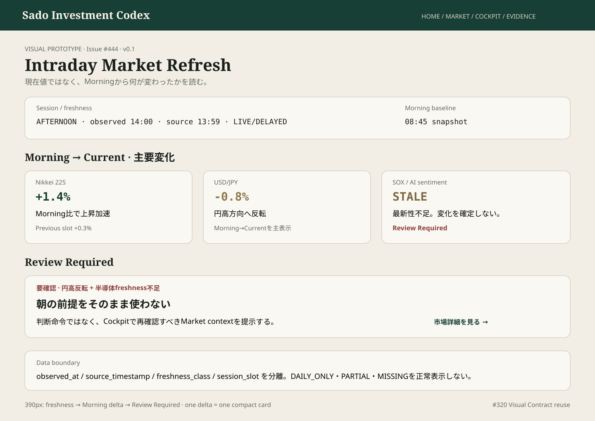

# #444 Intraday Market Refresh — Owner Delta Prototype

担当: ⭐️ミナ  
種別: Product UI Design / Visual Prototype  
Status: IMPLEMENTATION_HANDOFF_READY  
Version: v0.1  
Related: #444 / #320 / #460 / #349 / #307

## Prototype

Canonical artifact: `docs/design/prototypes/issue-444-intraday-refresh.svg`

## 目的
場中更新を「現在値の羅列」にせず、**Morning時点から何が変わり、その変化がどの程度freshで、何を再確認すべきか**を30秒以内に理解するOwner-facing surfaceとして固定する。

## 30秒の視線順
1. Market freshness / session slot
2. Morning → Current の主要変化 3〜4件
3. Previous slot → Current の補助差分
4. Review Required
5. Why / evidence freshness
6. Market detail drill-down

## Mobile Contract — 390px
- first viewportは `freshness → Morningからの主要変化 → Review Required`
- full market tableを先頭に置かない
- 1 delta = 1 compact card
- STALE / PARTIAL / MISSINGを正常表示へ丸めない

## Visual Contract
- #320 tokens / primitives / semantic statesを再利用
- `Morning → Current` と `Previous → Current` を混同しない
- `Review Required` をBUY/SELL/HOLDへ変換しない
- source_timestampだけでLIVE判定しない
- current valueよりdeltaを視覚的主役にする
- Home / Cockpitには要約のみ、full market detailはMarket surfaceへ残す

## Responsibility Boundary
- #444: Scheduled Market Observation / snapshot / delta
- #460: Provider freshness / confidence classification
- #307/#233: Human-triggered What-if calculation
- Cockpit: Decision Context

## Design Gate
### BLOCKER
- stale/daily-onlyデータをLIVEに見せる
- Morning→CurrentとPrevious→Currentの意味混同
- Review Requiredを売買推奨へ変換
- current values tableがdelta summaryより先
- Home/Cockpitへfull market tableを複製

### SHOULD_FIX
- session slot / observed_at / source_timestamp / freshness classが到達不能
- mobileで横スクロール前提
- failed/missing sourceを静かに欠落させる

### NICE_TO_HAVE
- delta sparkline
- session timeline marker
- changed-only filter

## Implementation Handoff
PR1aのintraday snapshot contractはmainへmerge済み。次のPages/read modelはcanonical snapshot/deltaのみを読み、provider freshnessの強さをUI側で上書きしない。

Design Gate: **PASS_WITH_NOTES**

Broadcast checked through: comment_id=5275700591 — VERIFIED  
TEAM_STATE User Mode: ACTIVE  
Issue #79 untouched.
