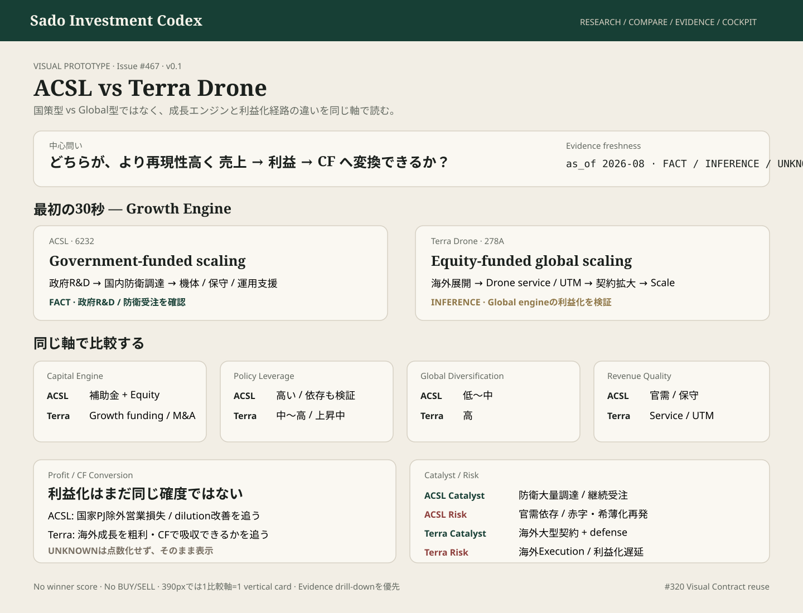

# #467 ACSL vs Terra Drone — Owner Comparison Prototype

担当: ⭐️ミナ  
種別: Product UI Design / Visual Prototype  
Status: IMPLEMENTATION_HANDOFF_READY  
Version: v0.1  
Related: #467 / #320 / #321 / #255 / #259

## Prototype

Canonical artifact: `docs/design/prototypes/issue-467-acsl-terra-comparison.svg`

## 目的

ACSLとTerra Droneを「どちらが上か」で比較せず、**異なる成長エンジン・資本構造・政策レバレッジ・利益化経路を同じ軸で30秒以内に理解する**ためのOwner-facing比較画面baseline。

## 30秒の視線順

1. 比較テーマ / as_of / Evidence freshness
2. 成長エンジンの違い — Government-funded scaling vs Equity-funded global scaling
3. Capital Engine / Policy Leverage / Global Diversification
4. Revenue Quality / Profit & CF Conversion
5. 最大Catalyst / 最大Risk
6. FACT / INFERENCE / UNKNOWNの境界
7. 各社Research / Evidenceへdrill-down

## Mobile Contract — 390px

desktop巨大tableを縮小しない。mobileでは**1比較軸 = 1 vertical comparison card**として、ACSL → Terra Droneの順で読む。

first viewportで最低限:
- 比較の中心問い
- 各社Growth Engine
- Evidence freshness
- 「勝者判定ではない」こと

を理解できること。

## Visual Contract

- #320 tokens / primitives / semantic statesを再利用する。
- ACSL / Terra Droneへ優劣を示すprimary color差を付けない。
- FACT / INFERENCE / UNKNOWNは色だけでなくlabelを必須にする。
- `政策レバレッジ高 = 良い`、`Global = 良い`のような単純scoreへ変換しない。
- Revenue / Profit / CFの未開示値を推測表示しない。
- BUY / SELL / winner badgeを生成しない。

## Responsibility Boundary

- Company Comparison: 成長構造の違いを同一軸で理解する。
- Company Research: 一社ごとのThesis / Evidence / Valuationを深掘りする。
- Policy Lead-Time: 外部政策の先行/遅行を検証する。
- Cockpit: 最終判断前のDecision Contextを統合する。

比較画面自身がInvestment Decision Authorityにならない。

## Design Gate

### BLOCKER
- winner score / BUY-SELL示唆
- UNKNOWNを弱い/negativeへ丸める
- FactとInferenceを同じvisual weightで混在
- mobileで横スクロール必須の巨大table
- ACSL=国策、Terra=Globalを永久ラベルとして固定
- #320外の比較専用theme / CSS体系

### SHOULD_FIX
- Growth Engineよりraw財務表が先に出る
- freshness / as_of / source drill-downが到達不能
- CatalystとRiskが片側だけ強調される
- Policy leverageとPolicy dependenceを同義表示

### NICE_TO_HAVE
- 軸ごとの「次に確認するKPI」1行
- must-happen / invalidationのcompact disclosure
- Evidence更新時のsmall delta marker

## Implementation Handoff

- 既存Company Research / Policy / Money Flow canonical sourceのみを読む。
- 同一軸のvalueが不足している場合は`UNKNOWN`を表示し、UI側で補完しない。
- desktopは2-column comparison、390pxではvertical card stack。
- 最上部に総合点やwinnerを置かず、Growth Engineの構造差を置く。
- 各cardから一次EvidenceまたはCompany Researchへdrill-down可能にする。

Design Gate: **PASS_WITH_NOTES — implementation may start when Research baseline is consumable.**

Broadcast checked through: comment_id=5275700591 — VERIFIED  
TEAM_STATE User Mode: ACTIVE  
Issue #79 untouched.
